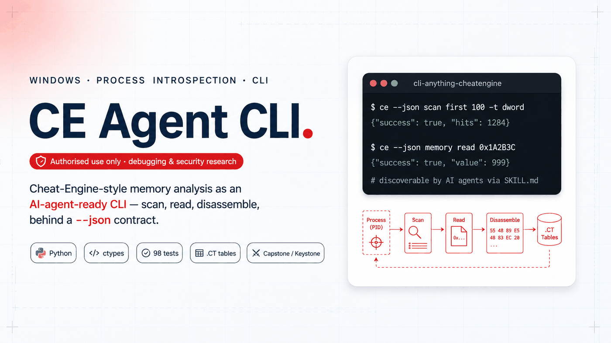
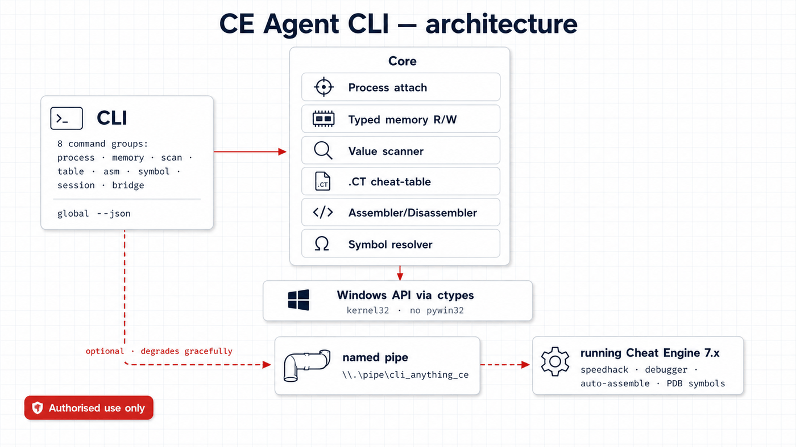
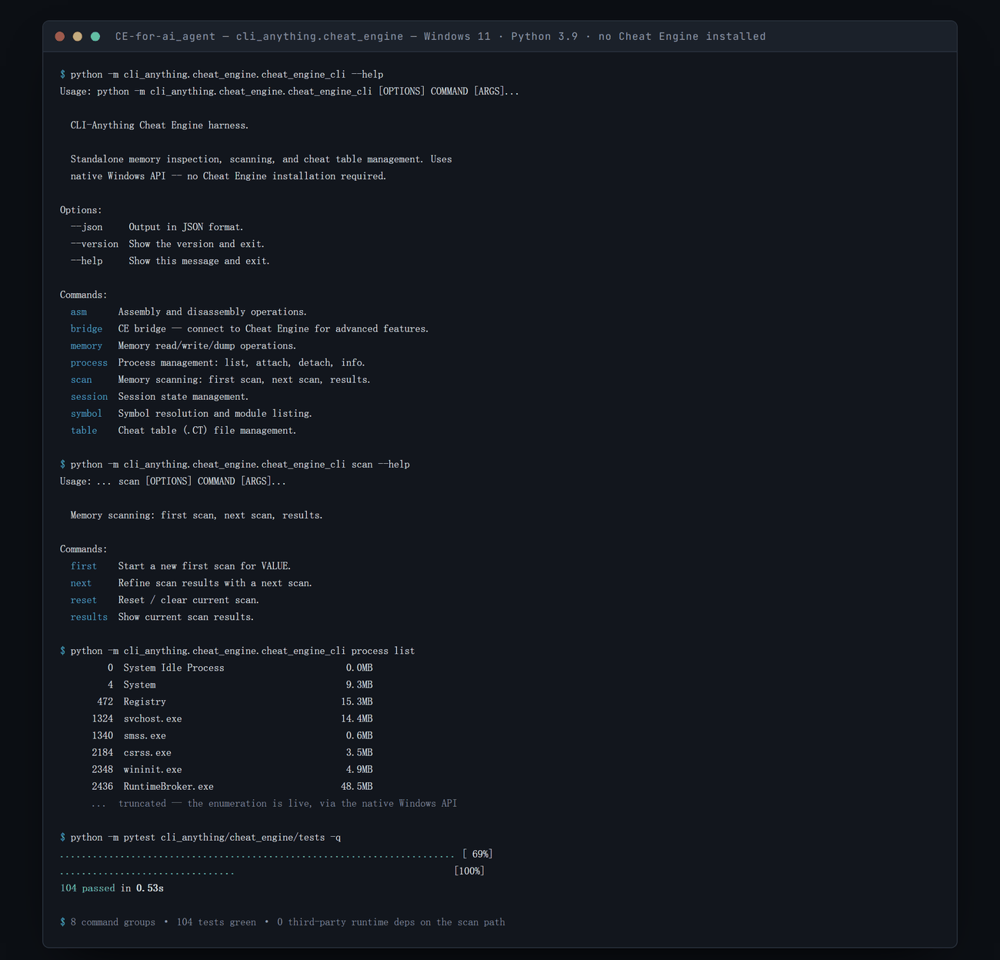

<div align="right"><a href="README.zh-CN.md">简体中文</a></div>

<p align="center"></p>

<p align="center">
  
  
  
  
  
</p>

CE Agent CLI (`cli-anything-cheatengine`) reimplements the core Cheat Engine workflow — process attach, typed memory read/write, value scanning, cheat-table (`.CT`) editing, assembly/disassembly, and symbol resolution — as a Windows command-line tool where **every command speaks a `--json` contract designed for AI agents**. When a Cheat Engine 7.x instance is running, an optional named-pipe bridge adds speedhack, the debugger, auto-assemble and PDB symbols; when it is not, the standalone core keeps working. It is built for local debugging, security research, and process introspection.

> [!WARNING]
> **Authorised use only.** Attach to and analyse only processes you own or have explicit written permission to inspect. Do not use this tool to bypass anti-cheat, DRM or licensing, to tamper with online or multiplayer games, or in violation of any terms of service or applicable law. See [`SECURITY.md`](SECURITY.md).

<p align="center">
  <a href="#-quick-start">Quick start</a> ·
  <a href="#-common-workflows">Common workflows</a> ·
  <a href="#-command-reference">Command reference</a> ·
  <a href="#-the---json-contract">JSON contract</a> ·
  <a href="#-the-cheat-engine-bridge">CE bridge</a>
</p>

## 🧭 Overview

**Problem.** Cheat Engine is a GUI built for a human clicking through dialogs. That makes its capabilities — scanning, typed memory edits, cheat tables, disassembly — nearly unusable from a script or an AI agent, which needs structured input and structured output, not a window to click.

**Solution.** This tool rebuilds that workflow as a composable CLI. It talks to Windows directly through `ctypes` (no `pywin32` layer), so the standalone core has no dependency on Cheat Engine itself, and a global `--json` flag turns every command into structured output an agent can parse. A shipped `SKILL.md` descriptor lets an AI agent discover the capability surface and drive it. Where a running Cheat Engine 7.x genuinely adds value — speedhack, a real debugger, auto-assemble, PDB symbols — an optional named-pipe bridge reaches into it, and degrades gracefully when CE is absent.

**Scope.** Windows-only, and dual-use by nature: it reads and writes another process memory space and can drive a debugger. It is for authorised local debugging, security research and process introspection, and [`SECURITY.md`](SECURITY.md) states that plainly. It is not a trainer, not an anti-cheat bypass, and ships no game-specific content. The 98-test suite runs with no administrator rights and no live target.

## ✨ Highlights

- **A broad command surface** — **8 command groups, 42 subcommands** covering process attach, typed memory, scanning, `.CT` tables, assembly, symbols, session state and the CE bridge.
- **An agent-ready `--json` contract on every command** — a global `--json` flag emits a structured envelope, and a `SKILL.md` descriptor lets an agent discover and drive the whole surface.
- **Standalone core, no Cheat Engine required** — process work goes straight to the Windows API through `ctypes` (no `pywin32`), so the core runs with nothing but Python.
- **Typed memory read/write with undo** — 7 value types (`byte` through `double`, plus `string`); every write records an undo entry, so `session undo` / `redo` restores the saved bytes.
- **Value scanning over committed memory** — first and next scans across 8 Cheat-Engine scan modes (`exact`, `between`, `bigger`, `smaller`, `increased`, `decreased`, `changed`, `unchanged`) on 6 numeric types.
- **Real `.CT` cheat-table editing** — load, save, list, add, remove, freeze and unfreeze entries through standard-library XML parsing: no Cheat Engine, no admin rights.
- **Optional assembly/disassembly** — Capstone and Keystone power the `asm` group when the `[asm]` extra is installed.
- **A Cheat Engine 7.x bridge** — a named-pipe link adding speedhack, the debugger, auto-assemble and PDB-capable symbol resolution, which degrades gracefully when CE is not running.
- **98 tests, no admin and no target needed** — 79 core plus 19 CLI tests run without administrator rights or a live process.

## 🏗 Architecture

<p align="center"></p>
<p align="center"><sub>A self-contained core over the Windows API, plus an optional bridge to a running Cheat Engine 7.x.</sub></p>

The CLI is the whole surface. Eight command groups sit on a **core** that does process attach, typed memory reads and writes, value scanning over committed regions, `.CT` cheat-table CRUD, assembly and disassembly, and symbol resolution — and that core talks to Windows directly through `ctypes`, which is why the standalone tool needs no Cheat Engine at all.

The dashed path in the diagram is the optional half. When a Cheat Engine 7.x instance is running, the CLI serves a named pipe that CE connects back to, gaining speedhack, the debugger, auto-assemble and PDB symbols; when CE is absent, those commands say so and everything in the core keeps working. Cutting across both halves is the global `--json` flag: any command can emit a structured envelope instead of human-readable text — the contract an AI agent drives the tool through.

## 🚀 Quick start

### Requirements

- **Windows** with **Python 3.9+**
- **Administrator privileges** for live memory operations (attach, read/write, scan, disassemble) — file and table operations need none
- Optional: the `[asm]` extra for assembly/disassembly, and **Cheat Engine 7.x** for the bridge

### Install

```bash
pip install -e .
```

<details>
<summary>With assembly/disassembly support</summary>

```bash
pip install -e ".[asm]"
```

This pulls in `keystone-engine` and `capstone`. Without it the `asm` group is unavailable and everything else works normally.

</details>

### Run the first command

```bash
cli-anything-cheatengine --json process list -n notepad
```

### What you should see

A structured envelope — no administrator rights needed for this one:

```json
{
  "success": true,
  "count": 1,
  "processes": [
    {
      "pid": 12345,
      "name": "notepad.exe",
      "exe": "C:\Windows\System32\notepad.exe",
      "username": "DESKTOP\you",
      "memory_mb": 24.3,
      "status": "running"
    }
  ]
}
```

Failures come back in the same shape — `{"success": false, "error": "..."}` — and **still exit 0**, so branch on the `success` field rather than the exit code. Without administrator rights, any command that attaches to a process returns a clear permission error instead of failing silently; see [Privileges](#-privileges).

## 🖥 A real session

<p align="center"></p>

<p align="center"><sub>Captured from an actual run on Windows 11 with <strong>no Cheat Engine installed</strong> — process enumeration goes through the native Windows API, which is the whole point of the standalone path. The 104-test suite runs in 0.53s and needs no target process, so it is safe to run in CI.</sub></p>

Two things worth noticing in that output. `process list` works with no target attached and no elevation, because enumeration and attachment are separate privileges — see [Privileges](#-privileges). And every group resolves to leaf commands that take `--json`, so the same session an operator drives by hand is the session an agent drives by parsing stdout.

## 📖 Common workflows

### Find a value in a running process and freeze it

```bash
cli-anything-cheatengine process list -n game          # find the PID
cli-anything-cheatengine process attach 1234           # attach (admin)
cli-anything-cheatengine scan first 100 -t dword       # first scan for 100
cli-anything-cheatengine scan next 95 -m exact         # the value changed to 95
cli-anything-cheatengine scan results --limit 10       # inspect the survivors
cli-anything-cheatengine memory write 0x1A2B3C 999 -t dword
cli-anything-cheatengine table add-entry table.CT -d "Health" -a 0x1A2B3C -t dword --frozen
```

### Narrow a scan without knowing the value

```bash
cli-anything-cheatengine scan first 0 -t float -m bigger
cli-anything-cheatengine scan next -m decreased        # after the value drops
cli-anything-cheatengine scan next -m unchanged        # after it holds steady
cli-anything-cheatengine scan reset                    # start over
```

`scan next` takes 8 modes: `exact`, `between`, `bigger`, `smaller`, `increased`, `decreased`, `changed`, `unchanged`.

### Edit a cheat table with no process and no admin

```bash
cli-anything-cheatengine table list-entries table.CT
cli-anything-cheatengine table add-entry table.CT -d "Ammo" -a "game.exe+0x4C210" -t dword
cli-anything-cheatengine table freeze table.CT 3
cli-anything-cheatengine table save table.CT -o table-edited.CT
```

`.CT` files are parsed and rewritten with the standard-library XML parser. Fields Cheat Engine stores beyond the six handled ones (auto-assemble scripts, offsets, hotkeys, Lua) are not preserved on save, so work on a copy.

### Undo a memory write

```bash
cli-anything-cheatengine session status     # what is attached, scan and undo depth
cli-anything-cheatengine session undo       # restore the previous bytes
cli-anything-cheatengine session redo
```

### Resolve a symbol and disassemble around it

```bash
cli-anything-cheatengine symbol list-modules              # no admin needed
cli-anything-cheatengine symbol lookup "game.exe+0x4C210" # admin
cli-anything-cheatengine asm disassemble 0x7FF6A2B10000 -c 20
```

### Drive Cheat Engine for the advanced features

```bash
cli-anything-cheatengine bridge detect        # is CE 7.x running?
cli-anything-cheatengine bridge start         # serve the pipe, print the .lua path
cli-anything-cheatengine bridge speed set 3.0
cli-anything-cheatengine bridge debug break 0x7FF6A2B10000
cli-anything-cheatengine bridge aa trainer.asm
cli-anything-cheatengine bridge stop
```

## 🧾 Command reference

Eight groups, 42 subcommands. `--json` is global; live-memory commands need admin (see [Privileges](#-privileges)).

| Group | Subcommands | What it does |
| --- | --- | --- |
| **process** | `list` · `attach` · `detach` · `info` | Find, attach to and inspect processes (`list` and `info` need no admin). |
| **memory** | `read` · `write` · `dump` | Typed read/write at an address, plus hex dumps. Every write is undoable. |
| **scan** | `first` · `next` · `results` · `reset` | Start a scan, refine it, page through results, reset. |
| **table** | `load` · `save` · `list-entries` · `add-entry` · `remove-entry` · `freeze` · `unfreeze` | Full `.CT` cheat-table editing — pure XML, no CE, no admin. |
| **asm** | `assemble` · `disassemble` · `inject` | Assemble and disassemble x86/x64 (`[asm]` extra); disassemble and inject against a live process. |
| **symbol** | `lookup` · `list-modules` | Resolve `module+offset` and PE exports; list loaded modules. |
| **session** | `status` · `history` · `undo` · `redo` · `reset` | Inspect and manage persisted session state; undo and redo memory writes. |
| **bridge** | `detect` · `start` · `status` · `lua` · `stop` · `aa` · `resolve` · `speed {set,reset}` · `debug {break,remove,continue}` · `ct {activate,deactivate}` | Drive a running Cheat Engine 7.x. |

**Value types** (`-t`): `byte`, `word`, `dword`, `qword`, `float`, `double`, `string`. The six numeric types are scannable; strings and byte-arrays are readable and writable but not scannable.

## 🔌 The `--json` contract

Every command accepts the global `--json` flag and emits a flat envelope: success merges `"success": true` with command-specific keys, failure is `{"success": false, "error": "<message>"}`. Errors still exit 0 — **an agent should branch on `success`, not on the exit code.**

```json
{ "success": true, "address": "0x1A2B3C", "type": "dword", "value": 100 }
```

```json
{ "success": true, "pid": 1234, "name": "game.exe", "handle": "0x2f0", "is_64bit": true }
```

```json
{ "success": true, "var_type": "dword", "result_count": 128,
  "scan_count": 2, "last_scan_option": "EXACT_VALUE", "elapsed_ms": 412 }
```

```json
{ "success": true, "total": 128, "offset": 0, "limit": 2,
  "results": [ { "address": "0x1A2B3C", "value": 95, "previous_value": 100 } ] }
```

## 🔗 The Cheat Engine bridge

The bridge is entirely optional — the core needs no Cheat Engine. When you do want the advanced features, the CLI runs the named-pipe **server** and Cheat Engine connects to it as the client:

1. `bridge detect` — confirm CE 7.x is running (no connection needed).
2. `bridge start` — start the pipe server; it prints the path to `ce_lua_client.lua`.
3. In Cheat Engine, open the **Lua Engine** (Ctrl+Alt+L), paste the contents of that file, and press **Execute** — CE connects back and announces its version.
4. `bridge speed`, `bridge debug`, `bridge aa`, `bridge ct` and `bridge resolve` (PDB-capable) now work; `bridge stop` disconnects.

The Lua client ships inside the package (`bridge/ce_lua_client.lua`) but is pasted in by hand — it is not a CE plugin or a `.CETRAINER`, and nothing is auto-installed into Cheat Engine. Because it is not declared as package data, install with `-e` (editable) if you intend to use the bridge.

## 🤖 Driving it from an AI agent

The shipped skill descriptor ([`cli_anything/cheat_engine/skills/SKILL.md`](cli_anything/cheat_engine/skills/SKILL.md)) is what lets an agent discover and operate the tool. It declares the binary name, nine trigger phrases (`memory scan`, `cheat table`, `speedhack`, `auto assemble`, and others), and a command reference explicitly split into *standalone* and *bridge* commands so an agent knows which need a running CE. It carries two end-to-end workflows — a standalone find-and-freeze, and a CE-advanced session — plus a documented degradation rule: probe with `bridge detect` before using any bridge command. Combined with the JSON envelope, an agent gets machine-readable output at every step.

## 🖥 Privileges

| Needs administrator | Runs without admin |
| --- | --- |
| `process attach`; all `memory` commands; `scan first` and `scan next`; `asm disassemble` and `asm inject`; `symbol lookup`; `session undo` and `redo` | `process list` / `info` / `detach`; `scan results` / `reset`; all 7 `table` commands; `asm assemble`; `symbol list-modules`; `session status` / `history` / `reset`; `bridge detect` |

Anything that attaches to a process requires administrator rights and raises a clear permission error rather than failing quietly. Bridge commands beyond `detect` additionally require a running, connected Cheat Engine 7.x.

## 🗂 Session state

Session state persists to `~/.cli-anything/cheat-engine/sessions/current_session.json`: the attached process, the loaded table, the scan flag and result count, an undo/redo stack of memory writes (last 50) and command history (last 100). A new write clears the redo stack; a corrupt file falls back to a fresh session. Scan *results* themselves are process-local and deliberately not persisted — only the count survives between invocations.

## 🖥 Compatibility

| Component | Support |
| --- | --- |
| Operating system | Windows only (`ctypes` against kernel32; no POSIX path) |
| Python | 3.9 or newer |
| Target architecture | 32-bit and 64-bit (`is_64bit` reported on attach) |
| Cheat Engine | 7.x, optional — bridge only |
| Assembly | Requires the `[asm]` extra (Keystone and Capstone) |
| Tests | Run on Windows with no admin and no live target |

## 🧰 Tech stack

| Area | Details |
| --- | --- |
| Language | Python 3.9+ |
| OS interface | Windows API via `ctypes` (no `pywin32`) |
| CLI and process | `click`, `psutil` |
| Optional `[asm]` extra | `keystone-engine`, `capstone` |
| `.CT` parsing | `xml.etree.ElementTree` (standard library) |
| Bridge | Cheat Engine 7.x over a named pipe (optional) |
| Console script | `cli-anything-cheatengine` |

## 🧪 Testing

```bash
pytest
```

**98 tests (79 core + 19 CLI)** run without administrator rights or a live target process. The CLI tests drive the Click `CliRunner` over the `table`, `session` and `--help` surfaces; `test_bridge.py` covers the named-pipe protocol without requiring Cheat Engine.

## 📊 Project status

- **Stable** — the standalone core: process, memory, scan, table, symbol and session groups, all covered by the test suite.
- **Optional extras** — the `asm` group needs the `[asm]` extra; the bridge needs a running Cheat Engine 7.x and a manually pasted Lua client.
- **By design** — scan results live only for the duration of one CLI process; `.CT` round-trips preserve the six handled fields and drop CE-specific extras; errors report through the JSON envelope rather than through exit codes.

## 🙋 Getting help

- **Usage and command syntax** — `cli-anything-cheatengine --help`, or the `--help` of any group; the [skill descriptor](cli_anything/cheat_engine/skills/SKILL.md) doubles as a full command reference.
- **Reproducible bugs** — open a GitHub issue with your Windows version, Python version, the exact command, and its `--json` output.
- **Security vulnerabilities** — do **not** open a public issue; follow [`SECURITY.md`](SECURITY.md).

## 🔒 Responsible use

> This tool is for **authorised** local debugging, security research and process introspection. Attach only to processes you own or have explicit written permission to inspect. Do not use it against anti-cheat, DRM or licensing systems, against online or multiplayer games, or in violation of any terms of service or law. Live memory operations require administrator rights by design, and the local named pipe should only be enabled in a trusted environment.

## 📄 License

MIT — see [`LICENSE`](LICENSE).

<p align="center"><sub>Built by <a href="https://github.com/SensLiao">Ruixuan "Sens" Liao</a> · USYD Advanced Computing (Honours)</sub></p>
